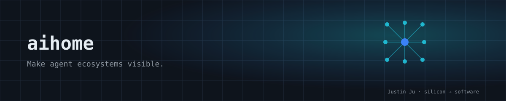

<p align="center">
  
</p>

# AIHome

**Make agent ecosystems visible.**
**让 agent 生态可见。**

A local-first visual workspace for discovering, organizing, and managing AI agents and skills. AIHome scans your directories for `AGENTS.md` / `SKILL.md` definitions and renders them as a drag-and-drop kanban board and a relationship graph.

本地优先的 `AGENTS.md` / `SKILL.md` 可视化工作区:扫描、看板、关系图、文件管理,全部在本机运行,数据不离开工作区。

> Runs entirely on your local machine. All data stays in your workspace — there is no backend service.

## Features / 功能

- **Kanban board** — drag agents across groups and reorder within columns; layout (group + order) is persisted to `.aihome/layout.json` and restored on refresh.
- **Relationship graph** — agents render as nodes with dagre auto-layout; edges show dependencies, auto-detected from `## Dependencies` sections and `depends-on` frontmatter; manual connections also supported.
- **Agent list & detail** — browse, search and filter by type, edit markdown content (with frontmatter editor for skills), inspect associated files.
- **File-system backed** — agents are plain markdown files; create, edit, delete through the UI, scanner re-reads the directory.
- **Workspace settings** — configure scan paths and groups; rescan on demand; export config.
- **Path-sandboxed file API** — `/api/files` only reads/writes within configured workspace paths (out-of-workspace requests return HTTP 403).

## Tech stack / 技术栈

- [Next.js 16](https://nextjs.org/) (App Router, Turbopack) + [React 19](https://react.dev/)
- [TypeScript](https://www.typescriptlang.org/)
- [Tailwind CSS 4](https://tailwindcss.com/)
- [Zustand](https://github.com/pmndrs/zustand) for state
- [@xyflow/react](https://reactflow.dev/) + [dagre](https://github.com/dagrejs/dagre) for the graph
- [@dnd-kit](https://dndkit.com/) for drag-and-drop
- [gray-matter](https://github.com/jonschlinkert/gray-matter) for frontmatter
- [Playwright](https://playwright.dev/) for end-to-end tests

## Getting started / 快速开始

```bash
npm ci
npm run dev
```

Open [http://localhost:3000](http://localhost:3000) — you'll be redirected to the board, pre-populated with the sample agents in `data/sample-agents/`.

The sample workspace is a no-account, no-API-key demo. Use a throwaway clone when trying create, edit, or delete operations so your own workspace files are not affected.

### Scripts

| Command | Description |
|---------|-------------|
| `npm run dev` | Start the dev server |
| `npm run build` | Production build |
| `npm run start` | Run the production build |
| `npm run lint` | ESLint |
| `npm run test:e2e` | Run the Playwright e2e suite (auto-starts the dev server) |
| `npm run test:e2e:ui` | Interactive e2e UI |

## Project structure / 项目结构

```
src/
├── app/
│   ├── api/            # Route handlers: agents, files, relations, scan, workspace, workspace/layout
│   ├── agents/         # Agent list + detail (edit) pages
│   ├── board/          # Kanban board page
│   ├── graph/          # Relationship graph page
│   └── settings/       # Workspace settings page
├── components/
│   ├── board/          # KanbanBoard, KanbanColumn, AgentCard, CardDetail
│   ├── graph/          # AgentGraph
│   └── layout/         # TopNav
├── lib/
│   ├── scanner.ts      # Directory scanner + dependency resolution
│   ├── parser.ts       # AGENTS.md / SKILL.md parsers
│   ├── file-utils.ts   # File tree builder
│   ├── workspace-config.ts  # .aihome/ config, layout, relations persistence
│   ├── path-security.ts     # Workspace path sandboxing
│   └── types.ts        # Core data models
└── stores/
    └── app-store.ts    # Zustand store
data/sample-agents/     # Four sample agents/skills
e2e/                    # Playwright tests, fixtures, helpers
```

## Agent & skill file format / 文件格式

AIHome discovers agents from `AGENTS.md` and skills from `SKILL.md` files anywhere under your configured scan paths.

**`AGENTS.md`** — the first `# H1` is the name, the first paragraph is the description, and `## H2` sections are captured. Declare dependencies with a `## Dependencies` section listing other agents by name:

```markdown
# Commit Helper

An intelligent commit message generator.

## Dependencies

- Code Assistant
```

**`SKILL.md`** — frontmatter holds metadata, and the body is markdown. Declare dependencies via `depends-on`:

```markdown
---
name: doc-writer
description: Generates comprehensive documentation for code projects.
license: MIT
depends-on:
  - Code Assistant
---

# Doc Writer
...
```

The scanner resolves dependency names to agent ids in a second pass and populates each agent's `dependencies` / `calledBy`, which the graph renders as edges.

## Configuration / 配置

AIHome stores runtime state under `.aihome/` (gitignored):

- `config.json` — workspace name, scan `paths`, and `groups`.
- `layout.json` — persisted board layout (`{ [agentId]: { group, order } }`).
- `relations.json` — manually created graph relations.

If `config.json` is absent, AIHome falls back to scanning the `data/` directory with the default groups (Default / Agents / Skills). Add scan paths in **Settings** to point at your own agent directories.

## API

| Method | Route | Purpose |
|--------|-------|---------|
| GET | `/api/agents` | List all scanned agents |
| POST | `/api/agents` | Create a new agent/skill |
| GET / PUT / DELETE | `/api/agents/[id]` | Read / update / delete one agent |
| POST | `/api/scan` | Rescan configured paths |
| GET / PUT | `/api/workspace` | Read / update workspace config |
| GET / PUT | `/api/workspace/layout` | Read / persist board layout |
| GET / PUT | `/api/relations` | Read / persist graph relations |
| GET / PUT | `/api/files` | Read / write a file (sandboxed to workspace paths) |

Agent ids are base64url-encoded file paths.

## Verification / 验证

- Playwright e2e covers board, graph, list, detail and settings flows.
- File and Agent-ID APIs reject paths outside configured workspaces (HTTP 403).
- CI runs install, lint, production build and browser tests.

## Status & roadmap / 状态与路线图

`v0.1.x` is the focused local developer-tool baseline. Existing `/api/*` success responses are treated as the compatibility boundary. Filesystem requests outside configured workspaces return HTTP 403. See [`docs/v0.2-roadmap.md`](docs/v0.2-roadmap.md), [`CHANGELOG.md`](CHANGELOG.md), and [`SECURITY.md`](SECURITY.md).

## License

[MIT](./LICENSE)
